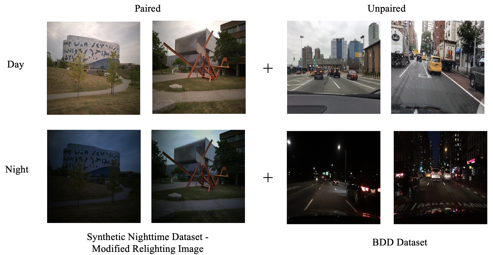
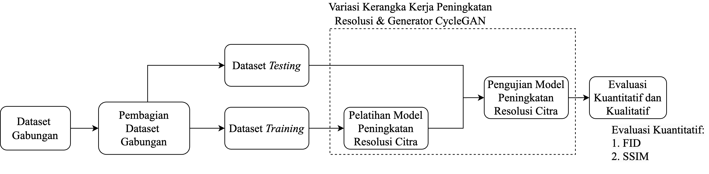
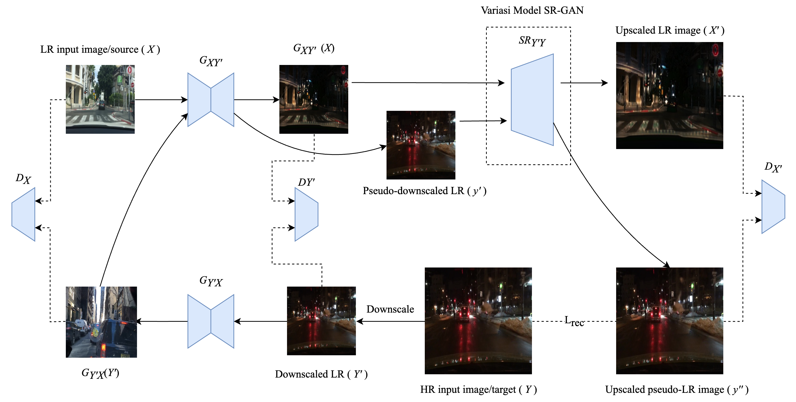
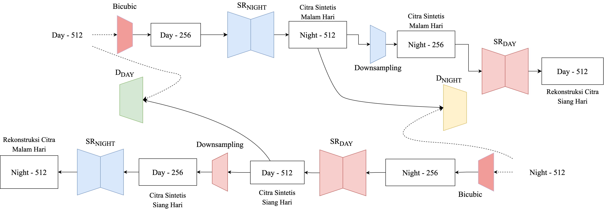
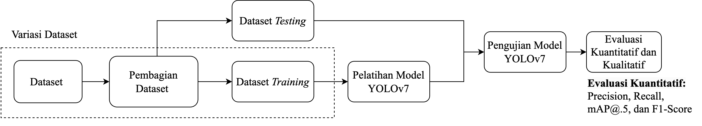
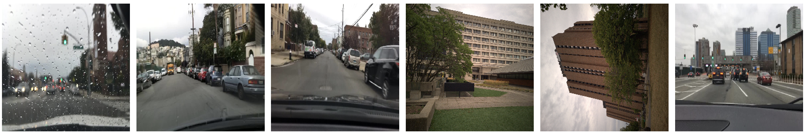
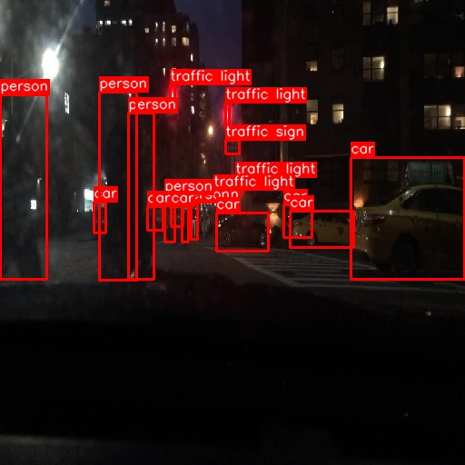
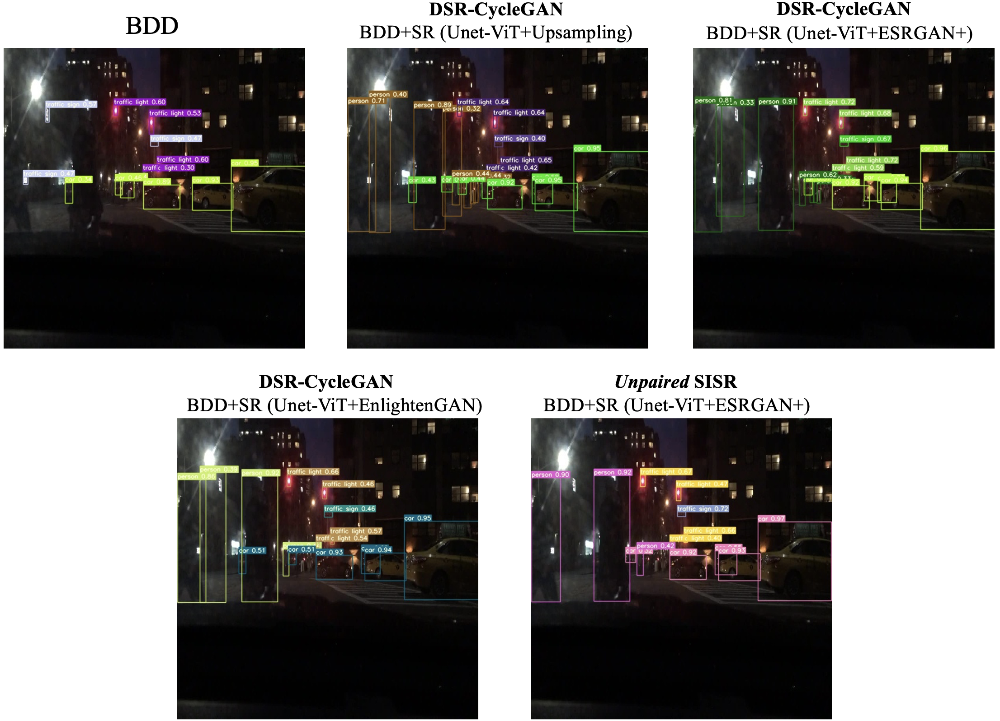

# increasing_synth_image

This project employs image processing approach as explained on [Day-to-Night Comparation github](https://github.com/mferiansyahrt/day_to_night_comparation).

## Dataset

### Super Resolution Method

The building process of this dataset is explained on [Day-to-Night Comparation github](https://github.com/mferiansyahrt/day_to_night_comparation).

This dataset is the same as explained on [Day-to-Night Comparation github](https://github.com/mferiansyahrt/day_to_night_comparation). The only difference is that the target image has a resolution of 512 x 512 pixels. While the input is 256 x 256 pixels.

    

### Downstream Task: Object Detection

The dataset used on Downstream Task for Object Detection comes from Berkley Deep Drive (BDD Dataset) [BDD100K: A Diverse Driving Dataset for Heterogeneous Multitask Learning](https://arxiv.org/pdf/1805.04687). The removal cause of dataset from image processing or conventional approach will be discussed later.

## Methods

### Super Resolution Method

The nighttime images were downscaled to 512 × 512 pixels and used as target data, while the low-resolution daytime images had a size of 256 × 256 pixels. After preparing the dataset, it was divided into training and testing sets. The model was then built and trained using the training set with an unpaired SISR approach and the proposed Direct Super-Resolution CycleGAN (DSR-CycleGAN) method. This process generated super-resolved synthetic nighttime images from low-resolution daytime inputs. The trained model was later tested using the testing set, with its performance evaluated both quantitatively and qualitatively.

    

The model was trained end-to-end without using a pre-trained model, ensuring it learns specific features directly from the dataset. Training was conducted on Google Colab Pro+ with an Nvidia A100 GPU. The model was developed using an unpaired SISR approach and DSR-CycleGAN with various generator architectures. Several hyperparameters were adjusted to support the research, including input and target image resolution, number of epochs, and learning rate.

<table><thead>
  <tr>
    <th>Hyperparameter</th>
    <th></th>
  </tr></thead>
<tbody>
  <tr>
    <td>Dataset </td>
    <td>Dataset Gabungan</td>
  </tr>
  <tr>
    <td>Input Size</td>
    <td>256 × 256 piksel</td>
  </tr>
  <tr>
    <td>Target Size </td>
    <td>512 × 512 piksel</td>
  </tr>
  <tr>
    <td>Epoch</td>
    <td>100</td>
  </tr>
  <tr>
    <td>Learning Rate</td>
    <td>0,0002</td>
  </tr>
  <tr>
    <td>Training Image</td>
    <td>70 (Paired) + 100 (Unpaired) = 170 Images</td>
  </tr>
  <tr>
    <td>Testing Image</td>
    <td>50 Images</td>
  </tr>
</tbody>
</table>

In this stage, the image super-resolution model was developed using two frameworks: unpaired SISR and DSR-CycleGAN. The UNet-ViT generator from the UVCGAN model was found to deliver optimal performance from [Day-to-Night Comparation github](https://github.com/mferiansyahrt/day_to_night_comparation) project. Therefore, this study utilized the UNet-ViT generator for both frameworks to facilitate domain transfer from daytime to nighttime images

<table><thead>
  <tr>
    <th>Framework</th>
    <th>Super-Resolution Model </th>
  </tr></thead>
<tbody>
  <tr>
    <td>Unpaired SISR</td>
    <td>UNet-ViT + ESRGAN+</td>
  </tr>
  <tr>
    <td rowspan="3">DSR-CycleGAN</td>
    <td>UNet-ViT + Upsampling</td>
  </tr>
  <tr>
    <td>UNet-ViT + ESRGAN+</td>
  </tr>
  <tr>
    <td>UNet-ViT + Enlighten-GAN</td>
  </tr>
</tbody>
</table>

Various image super-resolution models were explored, each paired with a corresponding upscaling model. As previously explained, the UNet-ViT generator was used for domain transfer, while the upscaling model handled spatial resolution enhancement.

#### Unpaired Single Image Super-Resolution (SISR)

Traditional Single-Image Super Resolution (SISR) methods typically rely on paired datasets, where high-resolution (HR) images are downscaled to create corresponding low-resolution (LR) versions. In this study, we utilize both paired and unpaired datasets, employing an unpaired SISR framework based on a semi-supervised Generative Adversarial Network (GAN) approach. Unlike conventional unpaired SISR methods that operate within the same domain—such as enhancing the resolution of nighttime images by mapping from low to high resolution within the nighttime domain—our research focuses on mapping daytime images to the nighttime domain while simultaneously increasing their resolution.

    

A common issue with paired SISR methods is that the downscaling process, often performed using mathematical operations like bicubic interpolation, may not effectively generate super-resolved images in unpaired data scenarios. Therefore, this study adopts an unpaired SISR approach to develop a Super-Resolution (SR) model, particularly considering the unpaired nature of the combined dataset, which includes the BDD dataset. In this framework, we employ an L1 loss function for Lrec.

#### Direct Super-Resolution CycleGAN (DSR-CycleGAN)
The proposed Direct Super-Resolution CycleGAN (DSR-CycleGAN) shares a similar overall structure with the standard CycleGAN architecture. However, in this study, the DSR-CycleGAN introduces specific modifications. While some research employs discriminators for both high-resolution (HR) and low-resolution (LR) images, and others use LR discriminators within the same domain, this study applies the HR discriminator exclusively to different domains.

    

In this architecture, SRDay and SRNight consist of a UNet-ViT generator paired with various upsampling models. The UNet-ViT generator utilizes 12 transformer blocks and employs an L1 loss function. The SRNight model processes LR daytime images with a resolution of 256 × 256 pixels, outputting synthetic SR nighttime images at 512 × 512 pixels; conversely, the SRDay model performs the reverse operation. Both DDay and DNight discriminators use a 70 × 70 PatchGAN architecture with L2 loss, receiving HR images as real labels and SR images as fake labels. Downscaling methods such as bicubic interpolation and convolutional downsampling are mathematical operations applied sequentially. Bicubic interpolation is chosen for producing smoother-textured LR images, while convolutional downsampling is employed to reduce noise artifacts, especially when the framework is trained with perceptual loss

### Downstream Task: Object Detection

Several variations of image super-resolution models were used to generate synthetic nighttime images, which served as augmented data for training the YOLOv7 model for object detection in nighttime images. The dataset used for training consisted of a mix of the BDD dataset and synthetic nighttime images from various SR models. Conventional synthetic datasets were not used because they lacked enough detectable object classes.

To assess the effect of synthetic data augmentation, YOLOv7 was trained on two datasets: the original BDD dataset and a combined BDD+SR dataset with synthetic nighttime images. The BDD dataset included 420 images (320 daytime and 100 nighttime), and 100 synthetic nighttime images were added, increasing the total dataset to 520 images.

<table><thead>
  <tr>
    <th colspan="2" rowspan="2"></th>
    <th colspan="2">Amount of Image</th>
  </tr>
  <tr>
    <th>Day</th>
    <th>Night</th>
  </tr></thead>
<tbody>
  <tr>
    <td colspan="2">BDD Dataset</td>
    <td>320</td>
    <td>100</td>
  </tr>
  <tr>
    <td>Unpaired SISR</td>
    <td>BDD+SR Dataset ( UNet-Vit+ESRGAN+)</td>
    <td rowspan="4">320</td>
    <td rowspan="4">200</td>
  </tr>
  <tr>
    <td rowspan="3">DSR-CycleGAN</td>
    <td>BDD+SR Dataset ( UNet-Vit+Upsampling)</td>
  </tr>
  <tr>
    <td>BDD+SR Dataset ( UNet-Vit+ESRGAN+)</td>
  </tr>
  <tr>
    <td>BDD+SR Dataset ( UNet-Vit+EnlightenGAN)</td>
  </tr>
</tbody>
</table>

The BDD and BDD+SR datasets focus on detecting objects from 10 classes, including cars, buses, people, bicycles, trucks, motorcycles, trains, riders, traffic signs, and traffic lights. Each class is labeled from 0 to 9 in sequence. All images in both datasets are 512x512 pixels in size and include corresponding bounding box labels for each object and its class. The image resolution is set to 512x512 pixels to match the resolution of the synthetic nighttime images generated by the resolution enhancement model.

    

The experiment design for the nighttime object detection downstream task using YOLOv7 is outlined. First, the dataset is split into training and testing sets. The variations in the training dataset are based on the datasets listed, while the testing set consists of 100 real nighttime images. Using the same testing dataset across different training dataset variations aims to evaluate the impact of additional data on the model's ability to detect objects at night. This reflects a scenario where augmented data serves as a supplementary component. However, in real-world scenarios, object detection at night would rely on actual nighttime images. After training, the model is evaluated both quantitatively and qualitatively. Several hyperparameters are adjusted during the training process, with a summary of these settings provided.

<table><thead>
  <tr>
    <th>Hyperparameter</th>
    <th></th>
  </tr></thead>
<tbody>
  <tr>
    <td>Epoch</td>
    <td>100</td>
  </tr>
  <tr>
    <td>Learning Rate </td>
    <td>0,01</td>
  </tr>
  <tr>
    <td>Batch Size </td>
    <td>8</td>
  </tr>
  <tr>
    <td>IoU Threshold</td>
    <td>0,65</td>
  </tr>
</tbody>
</table>

## Results

### Super Resolution Method

In this experiment, the optimal results were achieved using the DSR-CycleGAN framework with a UNet-ViT+Upsampling generator. Upsampling is a simple convolution method that can increase image resolution, essentially a transpose convolution. The use of the ESRGAN+ and EnlightenGAN generators resulted in both an increase and decrease in FID and SSIM values, respectively. This is due to the complexity of the architecture when combining the UNet-ViT generator with ESRGAN+ or EnlightenGAN, which leads to overly deep layers and potential vanishing gradients. 

<table><thead>
  <tr>
    <th rowspan="2">Framework</th>
    <th rowspan="2">Generator</th>
    <th colspan="2">Training</th>
    <th colspan="2">Testing</th>
  </tr>
  <tr>
    <th>FID</th>
    <th>SSIM</th>
    <th>FID</th>
    <th>SSIM</th>
  </tr></thead>
<tbody>
  <tr>
    <td>Unpaired SISR</td>
    <td>UNet-ViT + ESRGAN+</td>
    <td>57,6</td>
    <td>0,429</td>
    <td>69,3</td>
    <td>0,378</td>
  </tr>
  <tr>
    <td rowspan="3">DSR-CycleGAN</td>
    <td>UNet-ViT + Upsampling</td>
    <td><b>30,4</b></td>
    <td><b>0,485</b></td>
    <td><b>33,4</b></td>
    <td><b>0,468</b></td>
  </tr>
  <tr>
    <td>UNet-ViT + ESRGAN+</td>
    <td>39,5</td>
    <td>0,431</td>
    <td>47,8</td>
    <td>0,403</td>
  </tr>
  <tr>
    <td>UNet-ViT + EnlightenGAN</td>
    <td>46,8</td>
    <td>0,413</td>
    <td>58,4</td>
    <td>0,383</td>
  </tr>
</tbody>
</table>

The unpaired SISR framework performed the worst in both training and testing, in terms of FID and SSIM. However, its SSIM performance was slightly better than UNet-ViT+EnlightenGAN in DSR-CycleGAN. In this experiment, the unpaired SISR generated synthetic nighttime SR images from a generator that produced low-resolution images. In other words, the super-resolution part of unpaired SISR was trained using pairs of synthetic low-resolution nighttime images and high-resolution nighttime images.

#### Visualization

During the model testing phase, the input images were daytime images with a resolution of 256 × 256 pixels. Various test samples are shown in the images. Each daytime image served as input to the corresponding framework and generator variations. These images were from the BDD dataset and synthetic nighttime images generated using conventional methods.

    

The output images from the different framework and generator variations are displayed. It can be observed that in the unpaired SISR framework, the generated images appear blurrier compared to the others. This occurs because the unpaired SISR architecture trains the model between synthetic LR and HR images. In the DSR-CycleGAN framework, the UNet-ViT+ESRGAN+ or UNet-ViT+EnlightenGAN generators produced sharper images compared to conventional upsampling methods. However, the images generated by these two generators did not fully represent "nighttime," as there were light artifacts present in the UNet-ViT+ESRGAN+ generator outputs. The UNet-ViT+EnlightenGAN generator produced images with a more dominant blue color channel, resulting in images with blue-toned skies.

    

The UNet-ViT+Upsampling generator in DSR-CycleGAN provides the best quantitative evaluation and visually produces the most accurate "nighttime" scenes. This is supported by the FID evaluation metric, which aligns with human perceptual functions. Light artifacts in the UNet-ViT+ESRGAN+ or UNet-ViT+EnlightenGAN generators affect the evaluation scores of the images. However, the UNet-ViT+Upsampling generator still cannot produce optimal synthetic nighttime SR images for paired images. The target images in the paired dataset are also synthetic, meaning the generated images are highly dependent on the conventional methods used. Nevertheless, the synthetic nighttime SR images generated are visually aligned with those in the BDD dataset. The SSIM quantitative evaluation for UNet-ViT+Upsampling represents the optimal model. Visually, this generator produces superior illumination and contrast, but structurally, it remains less optimal. In contrast, the other two generators have better structure but still lack optimal illumination and contrast.

### Downstream Task: Object Detection

Based on the evaluation metrics, a precision increase of +0.09 was observed in the YOLOv7 model with the BDD+SR dataset using the UNet-ViT+Upsampling generator, compared to the BDD dataset, indicating the model's ability to avoid false positives. A significant recall increase of +0.258 shows the model's accuracy in detecting true positives. The +0.288 improvement in mAP@.5 suggests good overall prediction quality across all classes. The f1-score improvement of +0.203 demonstrates the model's balanced performance without significant trade-offs.

The synthetic nighttime SR images from the DSR-CycleGAN framework with the UNet-ViT+ESRGAN+ generator better detect ground truth proportions compared to UNet-ViT+Upsampling due to sharper features in the generated images. However, other evaluation metrics were less favorable for this generator compared to UNet-ViT+Upsampling.

For the unpaired SISR framework and the UNet-ViT+EnlightenGAN generator, no significant performance improvement was observed in YOLOv7 compared to the baseline with the BDD dataset. The generated images did not accurately represent nighttime scenes, leading to poorer generalization during YOLOv7 training, resulting in decreased performance.

<table><thead>
  <tr>
    <th colspan="2" rowspan="2"></th>
    <th rowspan="2">Precision</th>
    <th rowspan="2">Recall</th>
    <th rowspan="2">mAP@.5</th>
    <th rowspan="2">F1-Score</th>
  </tr>
  <tr>
  </tr></thead>
<tbody>
  <tr>
    <td colspan="2">BDD Dataset</td>
    <td>0,753</td>
    <td>0,462</td>
    <td>0,507</td>
    <td>0,573</td>
  </tr>
  <tr>
    <td>Unpaired SISR</td>
    <td>BDD+SR Dataset (UNet-Vit+ESRGAN+)</td>
    <td>0,652 (-0,101)</td>
    <td>0,482 (+0,02)</td>
    <td>0,543 (+0,036)</td>
    <td>0,554 (-0,019)</td>
  </tr>
  <tr>
    <td rowspan="3">DSR-CycleGAN</td>
    <td>BDD+SR Dataset (UNet-Vit+Upsampling)</td>
    <td><b>0,843 (+0,09)</b></td>
    <td>0,72 (+0,258)</td>
    <td><b>0,796 (+0,289)</b></td>
    <td><b>0,776 (+0,203)</b></td>
  </tr>
  <tr>
    <td>BDD+SR Dataset (UNet-Vit+ESRGAN+)</td>
    <td>0,794 (+0,041)</td>
    <td><b>0,735 (+0,273)</b></td>
    <td>0,795 (+0,288)</td>
    <td>0,763 (+0,19)</td>
  </tr>
  <tr>
    <td>BDD+SR Dataset (UNet-Vit+EnlightenGAN)</td>
    <td>0,703 (-0,05)</td>
    <td>0,512 (+0,05)</td>
    <td>0,554 (+0,047)</td>
    <td>0,592 (+0,019)</td>
  </tr>
</tbody></table>

#### Visualization

The testing image samples on object detection is done by comparing the detection performance of the model across five datasets with various framework and model variations. The testing image samples, along with their ground truth, are shown. The ground truth consists of seven cars, six people, four traffic lights, and one traffic sign. This ground truth serves as a reference for detection in both the BDD and BDD+SR datasets.

    

The comparison of YOLOv7's detection performance across the five datasets clearly shows the difference in human object detection. In the BDD dataset, no human objects were detected due to their low confidence score, with a threshold set at 0.25. This issue led to an increase in false negatives and a decrease in the recall metric. Additionally, YOLOv7 detected two false positives on traffic signs in the BDD dataset. However, this problem was addressed by using the BDD+SR dataset. The BDD+SR dataset demonstrated the effectiveness of synthetic nighttime SR images in object detection during the night, as evidenced by the increased detection of human objects and a reduction in false positives in the testing images. Objects like traffic signs and traffic lights were detected accurately. Despite the BDD+SR dataset being able to detect human objects, a few false positives for cars and humans remained. Overall, the synthetic nighttime SR images generated by the DSR-CycleGAN framework with the UNet-ViT+Upsampling generator improved YOLOv7's performance in detecting objects at night and outperformed the other frameworks.

    

